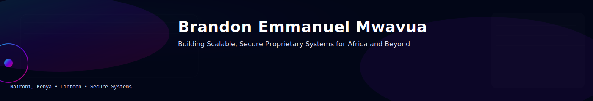

<!-- Profile Banner -->

  

<h1 align="center">👋 Hi, I'm Brandon Emmanuel Mwavua</h1>
<h3 align="center">💻 Building Scalable, Secure Proprietary Systems for Africa and Beyond</h3>

---

### 🚀 About Me

I'm a **Software Engineer** and **Fintech Innovator** based in **Nairobi, Kenya 🇰🇪**.  
I design and build **secure, scalable proprietary systems** that power digital finance and technology across Africa.

- 🧠 **Expertise:** Software Development, ICT, Fintech, Secure Systems  
- 💻 **Languages:** Java, JavaScript (React / Node.js), TypeScript  
- 🏦 **Focus Areas:** Banking Systems, API Security, Cloud Infrastructure, Redis Optimization  
- 🔭 Currently exploring **AI in Fintech** & **real-time transaction processing**

---

### 🧰 Tech Stack

  
  
  
  
  

🆎 Option C — Custom Neon Glow SVGs (I’ll design them manually)
⚡ Animated neon glow (like your earlier gradient concept)
🎨 Fully custom colors to match your banner
⚠️ But: GitHub may not render all animations properly (depends on browser).

So here’s the question:
Would you like to switch your profile to Option A (Professional Flat), Option B (Gradient Modern), or go for Option C (Custom Animated SVGs) where I design glowing badges to match your banner style?

Once you pick, I’ll rewrite your full README.md with the new badges ready to copy-paste.

---

### 🧩 Featured Projects

#### 🚗 MERN Car Management System  
A full-stack vehicle management system with CRUD, Redis caching, and secure authentication.  
**Tech:** MongoDB • Express • React • Node.js • Redis  
→ *[View on GitHub](https://github.com/em-brandon/)*  

#### 🧮 Java Swing Scientific Calculator  
A desktop calculator with FlatLaf UI, keyboard shortcuts, and scientific functions (sin, cos, log).  
→ *[View on GitHub](https://github.com/em-brandon/)*  

#### ❤️ Redis Favourites API  
Next.js + Redis API for real-time “likes/favourites” with anonymous cookie identification.  
→ *[View on GitHub](https://github.com/em-brandon/)*  

---

### 📊 GitHub Analytics

  
  

  

---

### 🐍 Contribution Graph

  

---

### 🌍 Connect With Me

  <a href="https://github.com/em-brandon" target="_blank">GitHub</a> •
  <a href="#" target="_blank">LinkedIn</a> •
  <a href="mailto:your.email@domain.com">Email</a>

---

  <i>“Code is where logic meets creativity. Fintech is where both create real impact.”</i> 
  — Brandon Emmanuel Mwavua

